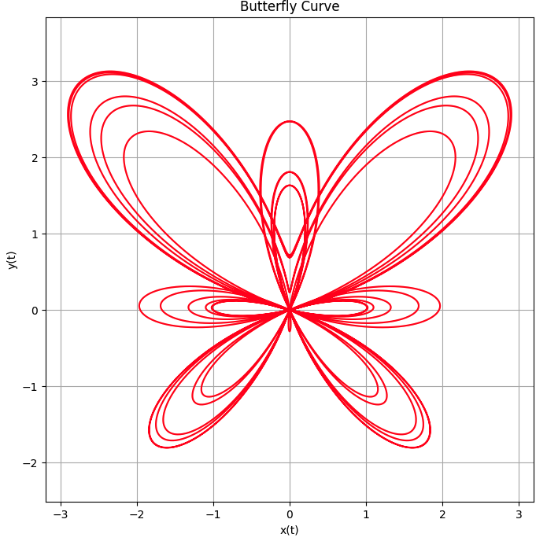
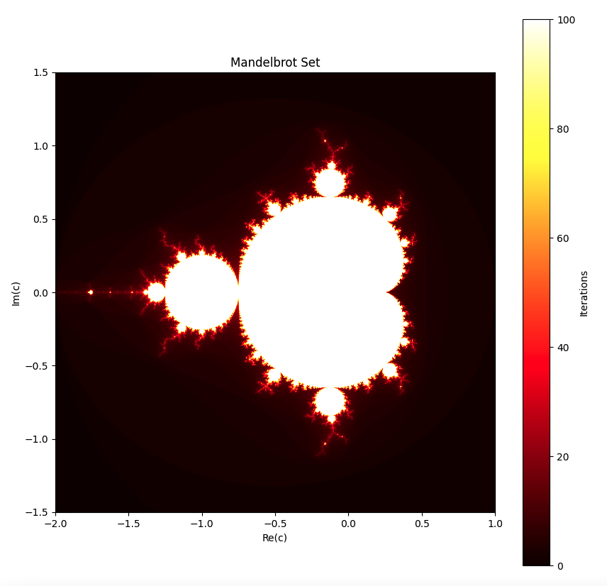
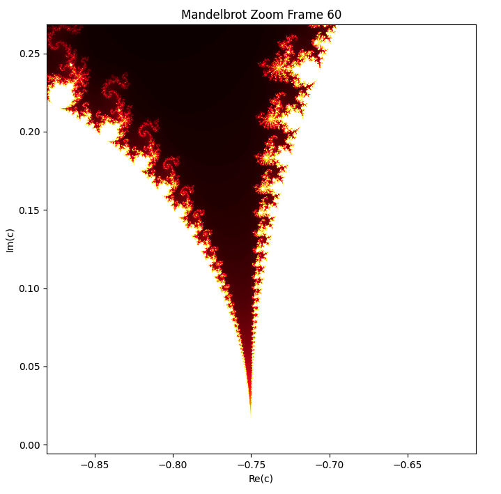
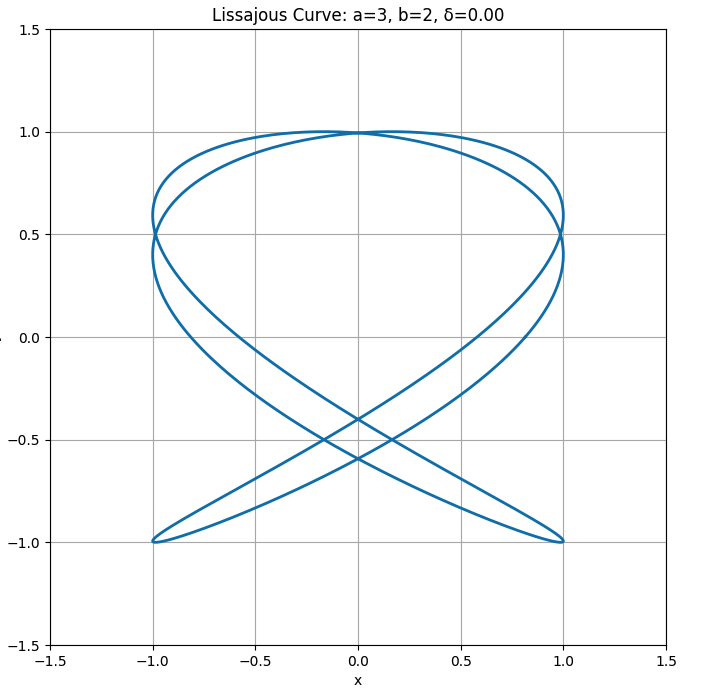
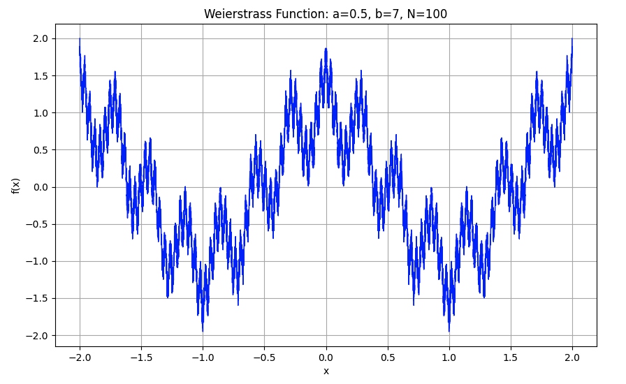
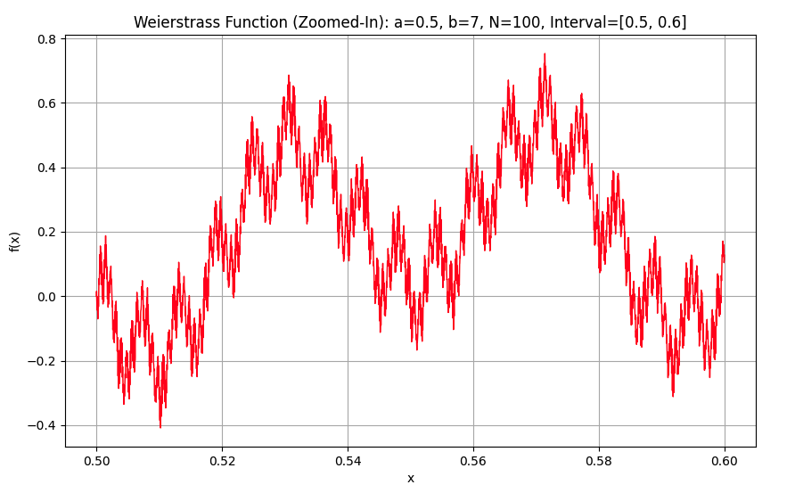

# Patterns of Infinity: Complexity and Repetition
Mathematical functions can produce stunning and visually captivating plots. Here’s a list of four of the most beautiful functions to plot, celebrated for their aesthetic appeal, symmetry, and intricate patterns.

## 1. Butterfly Curve (Transcendental)

### Equation
The **Butterfly Curve** is defined by the parametric equations:

$$ x = \sin(t) \left( e^{\cos(t)} - 2\cos(4t) - \sin^5\left(\frac{t}{12}\right) \right) $$

$$ y = \cos(t) \left( e^{\cos(t)} - 2\cos(4t) - \sin^5\left(\frac{t}{12}\right) \right) $$

parameter t over the range $0 \leq t \leq 12\pi$

### Why It's Beautiful
This curve produces a **symmetrical, butterfly-like shape** with intricate details, emerging from a simple mathematical formulation. The balance of trigonometric and exponential functions gives it a unique and elegant structure, making it a favorite in mathematical visualization.

### Visualization
To plot the Butterfly Curve in Python, use the following code, [View `butterfly.py`](Python/butterfly.py).  
For animation, use the following code, [View `butterfly_animation.py`](Python/butterfly_animation.py)  
Animaion output file is available for download: [View `butterfly_curve.mp4`](media/butterfly_curve.mp4).  

## 2. Mandelbrot Set (Fractal)

### Recursive Formula

The iteration formula that defines the **Mandelbrot Set** is:

$$ z_{n+1} = z_n^2 + c $$

where:  
- $z_n$ is a complex number,  
- $c$ is a constant complex parameter,  
- The sequence starts with $z_0 = 0$.  

The Mandelbrot Set consists of all points $c$ for which the sequence $z_n$ does not diverge to infinity (i.e., remains bounded).

### Why It's Beautiful

This simple equation produces one of the most famous fractals in mathematics: the **Mandelbrot Set**. Despite its simplicity, it generates infinitely complex and self-similar structures, revealing intricate details at every scale.

### Visualization - Steps to Plot the Mandelbrot Set

#### 1. Define the Complex Plane
Choose a range for the real and imaginary parts of $c$. Typically, this is:

$$ \text{Re}(c) \in [-2,1], \quad \text{Im}(c) \in [-1.5,1.5] $$

This defines the region of the complex plane where the Mandelbrot Set will be computed.

#### 2. Iterate the Formula
For each point $c$ in the complex plane, iterate the recursive formula:

$$ z_{n+1} = z_n^2 + c $$

starting from:

$$ z_0 = 0 $$

If the magnitude of $z_n$ exceeds a threshold (e.g., 2), the point $c$ is considered to **diverge** and is not part of the Mandelbrot Set.

#### 3. Color the Points
- Points that **diverge quickly** are assigned different colors based on the number of iterations it takes for $|z_n|$ to exceed the threshold.
- Points that do not diverge (part of the Mandelbrot Set) are typically colored black.

#### 4. Python Code to Plot the Mandelbrot Set
Here’s how you can implement this in Python using numpy and matplotlib, use the following code, [View `mandelbrot-set.py`](Python/mandelbrot-set.py).

**Explanation of the Code**  
- Complex Plane:  
The grid of complex numbers $c$ is created using np.meshgrid.

- Iteration:  
The formula $z_{n+1} = z_n^2 + c$ is iterated for each point $c$  
The mask array keeps track of points that haven’t diverged yet.  

- Output Image:  
The mandelbrot array stores the number of iterations it takes for each point to diverge (or max_iter if it doesn’t diverge).

- Plotting:  
The imshow function is used to display the Mandelbrot Set. The colormap (cmap='hot') assigns colors based on the number of iterations.

For animation, use the following code, [View `mandelbrot-set-animation.py`](Python/mandelbrot-set-animation.py).  
  
Animaion output file is available for download: [View `mandelbrot_zoom.mp4`](media/mandelbrot_zoom.mp4).  

## 3. Lissajous Curves

Lissajous Curves are parametric curves defined by the equations:

$$ x = A \sin(at + \delta) $$

$$ y = B \sin(bt) $$

where:  

- $A$ and $B$ are the **amplitudes** of the $x$ and $y$ oscillations, respectively.  
- $a$ and $b$ are the **frequencies** of the $x$ and $y$ oscillations, respectively.  
- $\delta$ is the **phase shift** between the oscillations.  
- $t$ is the **parameter** (typically representing time).  

### **Why Lissajous Curves?**
Lissajous curves are often used to **visualize the relationship between two oscillatory signals**, making them valuable in **physics, engineering, and signal processing**. They appear in **oscilloscope displays**, helping to analyze frequency ratios and phase differences between waveforms.

### **Visualization**
To plot the Lissajous Curves in Python, use the following code, [View `lissajous-curves.py`](Python/lissajous-curves.py).  
For animation, use the following code, [View `lissajous-curves-animation.py`](Python/lissajous-curves-animation.py)  
Animaion output file is available for download: [View `lissajous-animation.mp4`](media/lissajous-animation.mp4).  

## 4. The Weierstrass Function
  

The **Weierstrass Function** is a famous example of a function that is **continuous everywhere but differentiable nowhere**. It is defined as:

$$ f(x) = \sum_{n=0}^{\infty} a^n \cos(b^n \pi x) $$

where:

- $0 < a < 1$
- $b$ is a positive odd integer
- $ab > 1 + \frac{3\pi}{2}$

This function is **fractal-like** and exhibits self-similarity at different scales, making it both mathematically fascinating and visually beautiful.

### Why is the Weierstrass Function Beautiful?

#### **1. Fractal Nature**
- The function has a **self-similar** structure, meaning it looks similar at different scales.  
- This property is characteristic of **fractals**, which are often visually stunning.

#### **2. Continuous but Nowhere Differentiable**
- The function is **continuous everywhere**, but it has **no well-defined tangent at any point**.  
- This counterintuitive property **challenges classical calculus** and makes it a cornerstone in the study of **analysis**.

#### **3. Complexity from Simplicity**
- Defined by a **simple infinite series** of cosine terms, yet it produces an **infinitely complex and jagged curve**.  
- This **juxtaposition of simplicity and complexity** is aesthetically pleasing.

#### **4. Historical Significance**
- The **Weierstrass Function** was one of the first examples proving that **continuity does not imply differentiability**.  
- This **revolutionized mathematical analysis**.

### Steps to Plot the Weierstrass Function

#### **1. Truncate the Infinite Series**
Since we cannot compute an **infinite series** numerically, we approximate the function by summing a **finite number of terms** (e.g., $N = 100$).

#### **2. Define the Parameters**
Choose values for $a$ and $b$ that satisfy:

- $0 < a < 1$
- $ab > 1 + \frac{3\pi}{2}$

#### **3. Compute the Function**
Evaluate the truncated series for a range of $x$ values.

#### **4. Plot the Function**
Use a plotting library like **Matplotlib** to visualize the function.

#### **Example Plot**  
Here’s an example shows that like some other fractals, the Weierstrass Function exhibits self-similarity:

#### **Visualization**   
To plot the Weierstrass Function in Python, use the following code, [View `weierstrass.py`](Python/weierstrass.py).   
For zoomed in Weierstrass, use the following code, [View `weierstrass-zoom.py`](Python/weierstrass-zoom.py).  
For animation, use the following code, [View `weierstrass-animation.py`](Python/weierstrass-animation.py).   
Animaion output file is available for download: [View `weierstrass-animation.mp4`](media/weierstrass-animation.mp4).  

---

